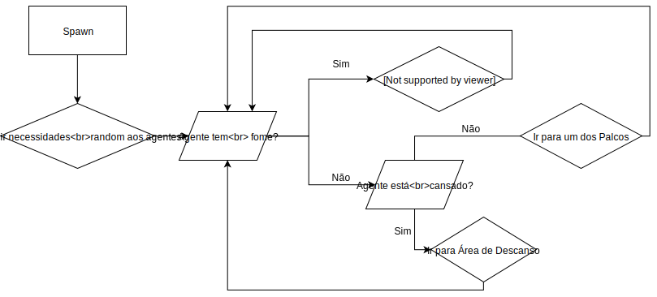
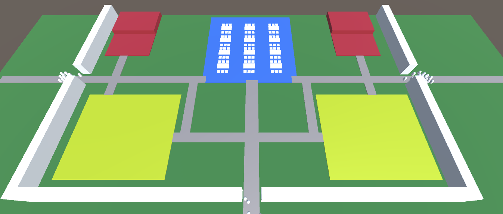
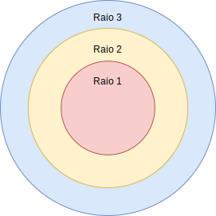

# 1º Projeto de A.I
## Autoria
Projeto em desenvolvimento pelos seguintes alunos:
* [André Pedro](https://github.com/andre-pedro) - Nº a21701115
* [Diogo Maia](https://github.com/IssaMaia) - Nº a21901308
* [Tiago Alves](https://github.com/Synpse) - Nº a21701031

## Distribuição de tarefas
Para a execução deste projeto, as tarefas foram repartidas de acordo com as aptidões de cada um:
* **André Pedro** - Elaboração do relatório
* **Diogo Maia** - 
* **Tiago Alves** -

## Introdução
Este projeto foi desenvolvido no âmbito da unidade curricular "Inteligência Artificial", onde nos foi proposto o desenvolvimento de uma simulação de um concerto, onde os agentes presentes no recinto tivessem necessidades como fome e cansaço. Foi-nos pedido também que os vários agentes reagissem a acontecimentos catastróficos (explosões) que ocorrem durante o evento. O projeto encontra-se no seguinte [repositório] de git, bem como o respetivo [enunciado].

_O Flowchart_ abaixo reflete o nosso processo de verificação de estados de cada agente no decorrer da simulação.


(Anexo 1 - Fluxograma)

No inicio da simulação, é pedido ao jogador para escolher a quantidade de agentes, bem como o número de saídas do recinto disponíveis.

### Pesquisa
Uma das grandes prioridades na gestão de eventos de grande escala (como concertos, estádios, entre outros) é a segurança. Em locais com imensas pessoas, tornar-se-ia bastante dispendioso construir diversos edifícios diferentes para comprovar qual deles teria o melhor método de segurança. Devido a esta necessidade, uma das maneiras mais económicas que [Neal Wagner e Vikas Agrawal](https://www.sciencedirect.com/science/article/pii/S0957417413008270?via%3Dihub) utilizaram foi simular situações catastróficas nos recintos em ambientes virtuais. A principal componente deste método é atribuir determinadas reações às pessoas (que nesta simulação são representados por agentes com inteligência artificial) perante a emergência. Para atribuir tais características semelhantes às de um ser humano, tivemos que utilizar diversos algoritmos que automatizassem as reações. Como tal, seguimos os principais algoritmos de movimento cinemático presentes em "[AI for Games](https://books.google.pt/books/about/Artificial_Intelligence_for_Games.html?id=zCiv-lMad-AC&redir_esc=y)", de Ian Millington: Seek e Flee. Aplicámos o primeiro aos agentes para poderem locomover-se do ponto A ao ponto B de forma individual e independente. Já o segundo é aplicado na presença de uma explosão, fazendo com que os agentes se afastem do centro da explosão.
Tendo os comportamentos da I.A. funcionais, passámos para a implementação do recinto. Espalhámos as zonas tendo em conta como alguns festivais (como [Rock in Rio](https://s3.amazonaws.com/cdn.rockinrio.com.br/uploads/news_images/9857/mapa_RiR2016.png), [Super Bock Super Rock](https://fotos.web.sapo.io/i/G1d11052b/18587131_fr3LN.jpeg), [MEO Sudoeste](https://ohmdj.files.wordpress.com/2015/07/mapa-recinto-meo-sudoeste.png), entre outros) o fazem, de modo a terem o máximo de equidistância uns dos outros possível.
Para caminhar em caminhos diferentes usámos diferentes _costs_ da _navmesh_, porque achámos ser a maneira mais simples de implementar os diferentes caminhos possíveis.

## Metodologia
A simulação foi implementada utilizando a Game Engine "Unity", num projeto 3D. A _build_ da mesma foi feita para Windows (64 bits).

### Agentes
Recorrendo a sistemas de inteligência artificial nos agentes presentes, estes navegam no festival numa _navmesh_. A quantidade de agentes presentes é definida através de um _input_ que pode ser alterado no inicio da simulação.

Mediante as condições, estes agentes respondem com os seguintes comportamentos:

* "**Seek**" - Sendo a acção que dá a maior "autonomia" aos agentes, o comportamento _seek_ acontece sempre que cada agente precisa de se deslocar para um local (por exemplo, quando alguém se desloca para um palco ou outra zona).
* "**Idle**" - Considerado o comportamento "neutro", os agentes ficam estáticos no estado _idle_ quando são atingidos pelo 2º raio de explosões.

* "**Flee**" - Quando ocorre uma explosão, os agentes num determinado raio (ver secção "Explosões") correm na direção oposta.

#### Necessidades

Os agentes possuem duas necessidades: Fome (`hunger`) e Cansaço (`tired`). Estes parâmetros são aleatórios no inicio da simulação. Quando a fome de um agente é igual ou inferior a 25, este abandona o local onde se encontra e vai para a área de restauração. Se o seu cansaço estiver igual ou inferior a 50, este vai procurar uma zona de descanso para recuperar.

```cs
private void ChecksStats()
    {
        if (hunger <= 25f)
        {
            isHungry = true;
            isGoingToFun = false;
            isGoingToRest = false;
        }
        else if(hunger > 50f)
        {
            hasFoundSeat = false;
            isHungry = false;            
        }
        if (tired <= 50f)
        {
            isGoingToFun = false;
            isGoingForFood = false;
            isTired = true;
        }
        else if(tired > 50f)
        {
            isTired = false;
        }
    }
```
 A permanência de um agente numa área aumenta exponencialmente o valor correspondente. Ao ter as necessidades favoráveis para o efeito, o agente calcula o palco com menos agentes e desloca-se para o mesmo. No caso de ambos os palcos terem exatamente a mesma quantidade de agentes, é feito um _random_ para decidir para onde é feita a deslocação.

### Zonas / Áreas

No recinto do festival existem 3 zonas:

* **Palcos** - Estão presentes dois palcos na simulação. Ao chegar a um palco, o agente escolhe uma posição aleatória na primeira fila e tenta aproximar-se o mais possível da mesma, sem empurrar nenhum outro agente.

* **Área de Restauração** -  Local com diversas mesas e cadeiras onde os agentes se deslocam quando a sua fome desce, permanecendo no local até o valor ficar acima de 50. Ao dirigir-se para o local, o agente reserva um lugar o mais afastado possível dos restantes. Quando um agente escolhe um lugar, só ele é que pode lá ficar.

* **Zonas de Descanso** - Quando os agentes precisam de aumentar o valor de `tired`, deslocam-se para as Zonas de Descanso, onde escolhem um sítio livre aleatório e ficam nele até estarem com o valor dentro dos parâmetros aceitáveis.

Existem duas formas de andar no recinto: Pelos caminhos pré-definidos e pelo caminho mais curto. Numa situação normal, os caminhos pré-definidos têm um custo inferior do que o caminho mais curto, fazendo com que a I.A. caminhe pelos mesmos. Numa situação de emergência (uma explosão) os custos são invertidos, e os agentes passam a andar pelo caminho mais curto.

 Anexo 2 - Recinto. A vermelho os palcos, amarelo as àreas de descanso e a azul a área de restauração. 

### Explosões

O jogador pode escolher com o rato o local onde quer causar uma explosão. Ao clicar com o rato, é criada uma explosão com 3 raios:

* **1º Raio** - Todos os agentes morrem;

* **2º Raio** - Todos os agentes ficam atordoados (`stunned`) (ver secção Reações), ficando  parados num intervalo de tempo entre 2 a 10 segundos. Passado esse tempo, voltam a andar, porém com velocidade reduzida em -50%.

* **3º Raio** - Todos os agentes são assustados (`scared`), fugindo na direção oposta da explosão. Se um agente assustado entrar em contacto com outros agentes, estes ficam assustados também.


(Anexo 3 - Raios de Explosão)

Perante as explosões, os agentes podem reagir de maneiras diferentes. Ao serem atingidos nos raios 2 ou 3, para além do referido anteriormente, ficam também em pânico. Agentes com `panic` afetam outros agentes perto deles, fazendo com que fiquem em `panic` também.

Após a explosão, o fogo causado pela mesma vai aumentando e espalhando-se pelo recinto. Se um agente é atingido pelo fogo, morre.

## Resultados e Discussão
De um modo geral, a I.A. comportou-se como o esperado. No entanto, descobrimos alguns comportamentos emergentes presentes na simulação, onde agentes fazem filas para ir para algum sitio, e em distâncias pequenas, alguns agentes cortam caminho independentemente do custo dos mesmos.

## Conclusão
Na elaboração desta simulação foi-nos possivel concluir que:
* É uma das melhores maneiras de prever acontecimentos inesperados em eventos de grande escala;
* É bastante interessante observar o comportamento dos agentes, descobrir comportamentos emergentes e tentar deduzir as reações dos mesmos às explosões;
* Descobrimos através do diálogo com colegas que existem diversas maneiras de fazer a simulação, e que existem vários fatores que geram ou retiram diferentes comportamentos emergentes.


## Agradecimentos

* Prof. Nuno Fachada

## Referências
* Wagner, N. & Agrawal, V. (2014). "An agent-based simulation system for concert venue crowd evacuation modeling in the presence of a fire disaster".

* Silva M. V., Scholl V. M., Adamatti, D. (2017) ["Simulação Multiagente da Evacuação da Boate Kiss: A Importância da NBR 9.077 e sua Relação com o 'Pânico'"](https://www.researchgate.net/publication/321713849_Simulacao_Multiagente_da_Evacuacao_da_Boate_Kiss_A_Importancia_da_NBR_9077_e_sua_Relacao_com_o_'Panico'_Multia-Agent_Simulation_of_the_Kiss_Nightclub_Evacuation_The_Importance_of_NBR_9077_and_its_rela)

* Millington, I. (2019). AI for Games (3rd ed.). CRC Press.


[repositório]:https://github.com/andre-pedro/projeto1Ai
[enunciado]:https://secure.grupolusofona.pt/ulht/moodle/pluginfile.php/669636/mod_assign/introattachment/0/p1.pdf?forcedownload=1